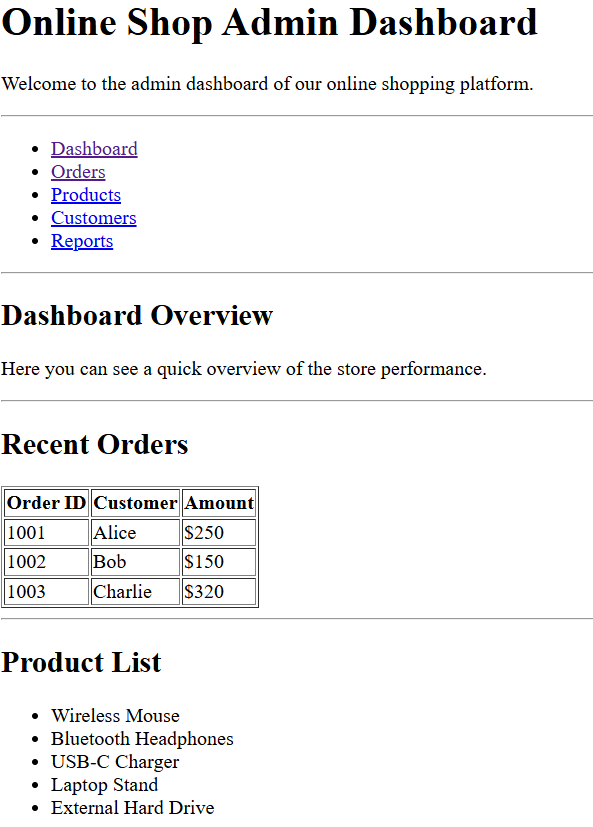

# Lab 2: HTML5 – Dashboard Content Structure

## Objective

Create the **core content sections** of the Online Shop Admin Dashboard using HTML5, preparing for future CSS styling.

---

## Lab Instructions

1️⃣ Open your `online-shop-dashboard` folder and create a new file `lab2.html`.

2️⃣ Copy your structure from `lab1.html` to `lab2.html` so you can continue building on it.

3️⃣ Inside the `body`, add the following sections:

- A `main` tag to hold the main dashboard content.
- Inside `main`, add:
  - A `section` with `id="dashboard"` containing a heading and a short description.
  - A `section` with `id="orders"` containing a heading and a table with **dummy order data** (at least 3 rows, using `table`, `thead`, `tbody`, `tr`, `th`, `td`).
  - A `section` with `id="products"` containing a heading and an **unordered list** of 5 product names.

4️⃣ Ensure your structure uses **semantic HTML5 tags** clearly.

5️⃣ Open using **Live Server** or browser and test internal navigation by clicking on your nav links.

6️⃣ Take a screenshot of your output (`lab2_output.png`) for your lab folder.

## 📌 Expected Output
  