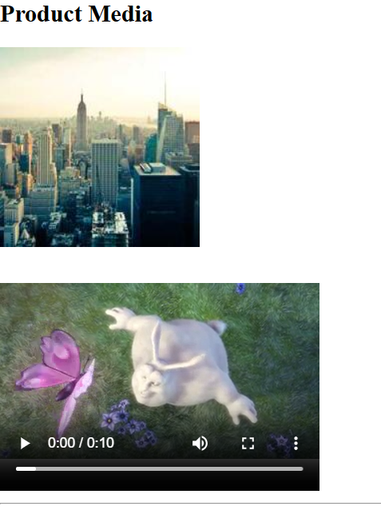
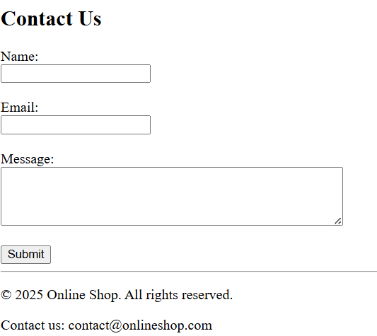

# Lab 3: HTML5 – Media, Forms, and Footer

## Objective

Extend your Online Shop Admin Dashboard with **media embedding, a basic form, and a structured footer** using HTML5.

---

## Lab Instructions

1️⃣ Open your `online-shop-dashboard` folder and create a new file `lab3.html`.

2️⃣ Copy your structure from `lab2.html` to `lab3.html` so you can continue building on it.

3️⃣ Inside the `main` tag, **add these sections below your previous content:**

- A `section` with `id="media"` containing:

  - An `h2` heading.
  - An `img` tag displaying a product-related image / or any image (use any local or online image with appropriate `alt`).
  - A `video` tag (with `controls`) embedding a short relevant video from a public URL (or local placeholder) demonstrating a product or store overview.

- A `section` with `id="contact"` containing:

  - An `h2` heading.
  - A **simple form** with:
    - `input` fields for Name, Email.
    - A `textarea` for Message.
    - A `submit` button.

4️⃣ After the `main` tag, add a `footer` containing:

- A `p` tag with copyright.
- A `p` with a simple note about contact email or store address.

5️⃣ Ensure correct and clean **semantic structure**.

6️⃣ Take a screenshot of your output (`lab3_output.png`) for your lab folder.

## 📌 Expected Output
  

