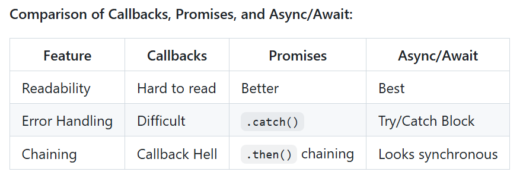

# Asynchronous Programming
Asynchronous programming allows JavaScript to execute long-running tasks without blocking the main thread. This helps keep applications responsive, especially in web development.

# Callback function
A function passed into another function as an argument and executed after a task is completed.

# Promises: 
Objects representing the eventual success or failure of an asynchronous task.
They have three states: pending, fulfilled, or rejected.

callback - nested callbacks 

promises - ES 6 

async/await

